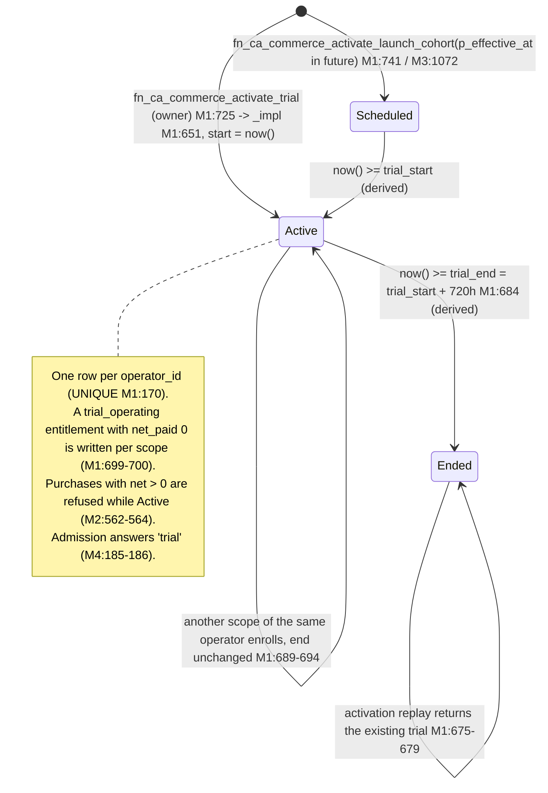
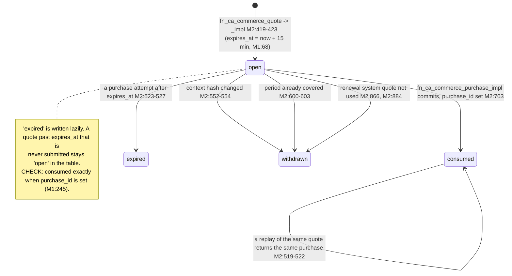
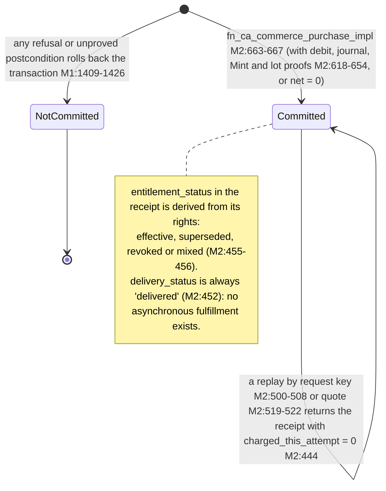
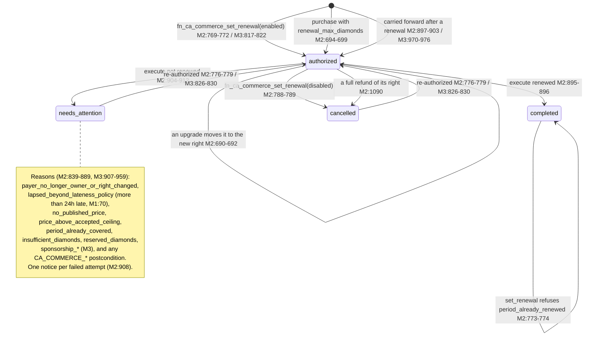
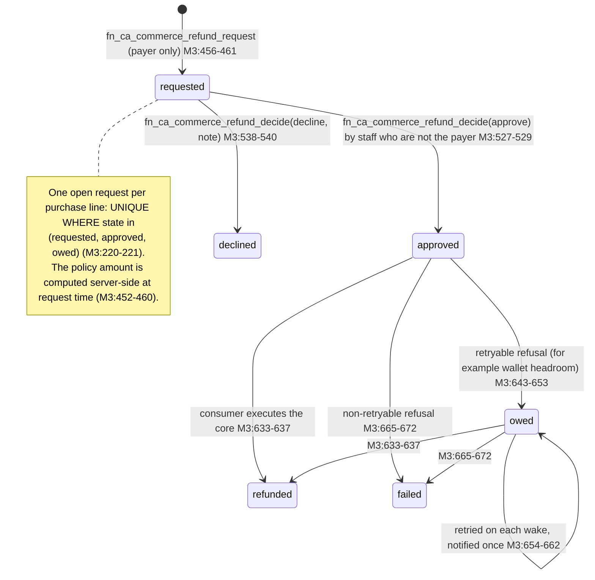
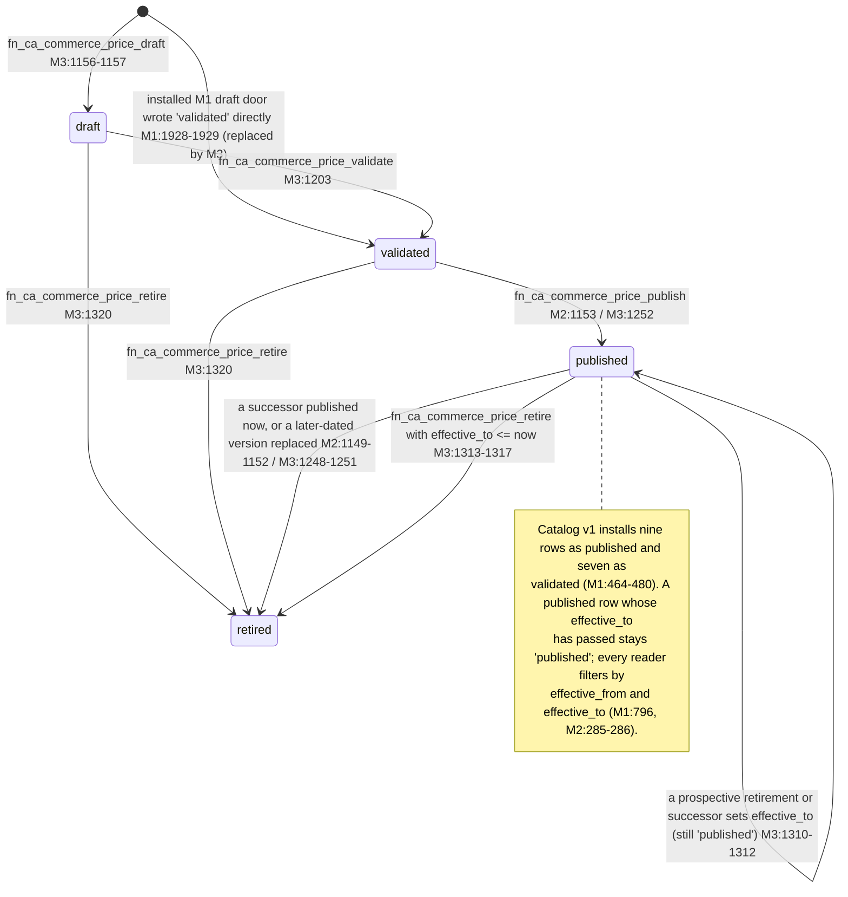
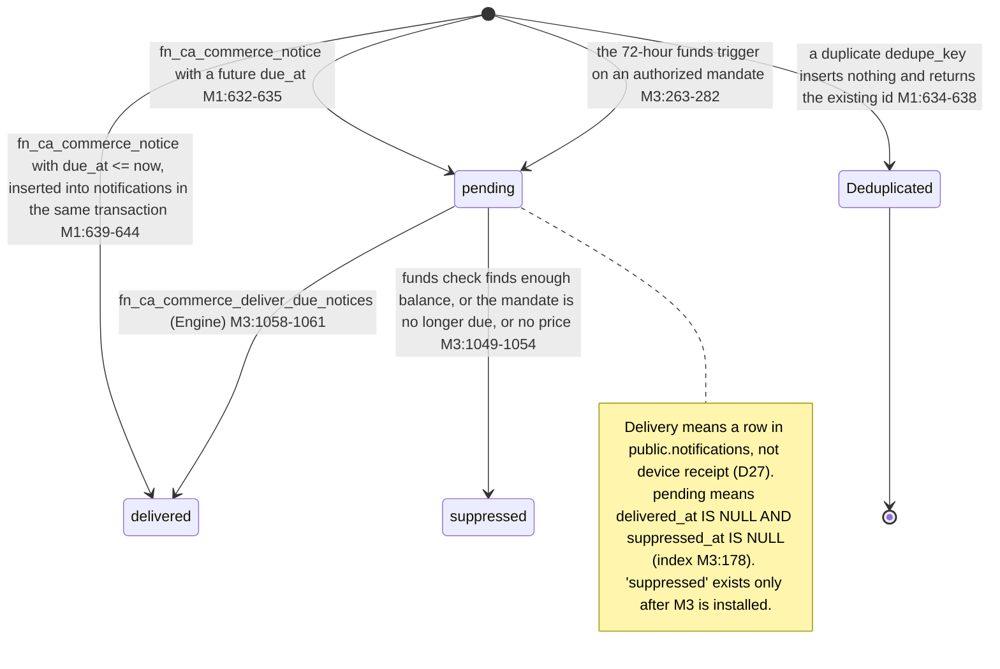

# Commercial State Diagrams

R2 line 1699 asks for a "commercial state diagram and real source/function/table/permission map". The source, function, table and permission map is `c1-wiring-map.md`. The diagrams below cover the eight commercial records: trial, quote, purchase, entitlement, renewal mandate, refund request, price version and notice.

Every transition is labelled with the function that performs it and a `file:line` reference. Short names follow `c1-wiring-map.md`:

| Short name | File             |
| ---------- | ---------------- |
| M1         | `20260922143541` |
| M2         | `20260924033509` |
| M3         | `20260924102040` |
| M4         | `20260924102056` |

States written in _italics_ in the notes are **derived from time** and have no column value. Each diagram draws only transitions that code performs. If a state has no outgoing edge, no code moves a row out of it.

## 1. Trial (`ca_commerce_trials`, `ca_commerce_trial_scopes`)

A trial row is never updated after insert. No function in M1 to M4 updates or deletes `ca_commerce_trials`. Its phase comes from `trial_start` and `trial_end` alone, compared with `now()` (M1:540-544).

## 2. Quote (`ca_commerce_quotes.status`, CHECK M1:240)

## 3. Purchase (`ca_commerce_purchases`)

A purchase has no status column. The row is written once and is append-only: the trigger `ca_commerce_purchases_append_only` (M1:435-436) refuses every UPDATE and DELETE. Every state the receipt reports is derived.

## 4. Entitlement (`ca_commerce_entitlements.state`, CHECK M1:297)

```mermaid
stateDiagram-v2
    [*] --> effective: trial right M1:699-700
    [*] --> effective: purchase line M2:679-685 (source purchase or sponsor)
    state effective {
        [*] --> Scheduled
        Scheduled --> InForce: now() >= starts_at (derived)
        InForce --> PastEnd: now() >= ends_at (derived; row stays 'effective')
    }
    effective --> superseded: an upgrade replaces it; ends_at is set to the switch instant M2:689
    effective --> revoked: a full refund of its line M2:1088-1089
    note right of superseded
        superseded_by points to the new right (revision + 1).
        The value it carries forward is value_basis = net + credit (M2:683).
    end note
```

## 5. Renewal mandate (`ca_commerce_renewal_mandates.state`, CHECK M1:332; one per right M2:97-98)

## 6. Refund request (`ca_commerce_refund_requests.state`, M3:184-219, **pending install**)

The executed refund itself is a separate append-only row in `ca_commerce_refunds` (M1:349, trigger M1:437). A staff service-route call to the core `fn_ca_commerce_refund` (M2:958) can also create that row without any request.

## 7. Price version (`ca_commerce_price_versions.status`, trigger M1:123-158)

The trigger allows only these moves:

- draft to validated or retired
- validated to published or retired
- published to retired

A published or retired row can never change its price fields.

## 8. Notice (`ca_commerce_notices`, dedupe key UNIQUE M1:388)

